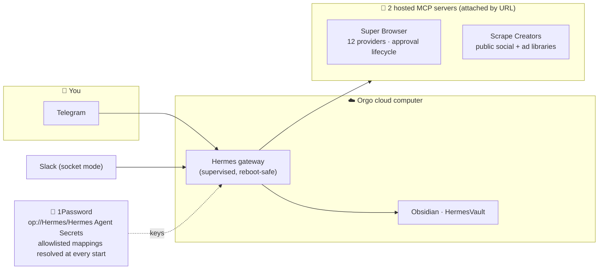

<div align="center">


# Revenue Partner Agent 🚀

**A source-grounded GTM operator that runs one Money Desk across reactivation, targeted outbound, affiliates, stages/sponsors, and coordinated content.**

[](https://github.com/jbellsolutions/revenue-partner-agent/actions/workflows/ci.yml)
[](docs/VERIFICATION.md)
[](https://github.com/NousResearch/hermes-agent)
[](#-whats-in-the-box)
[](docs/ARCHITECTURE.md)
[](#-your-keys-stay-yours)
[](LICENSE)

*Built on the supplied always-on Hermes/Orgo stack.*
*Grounded in the Revenue Partner landing page and all three supplied implementation videos.*

</div>

---

## Revenue Partner operating model

The template does not just rename the base agent. It adds a GTM execution contract derived from the supplied landing page and three implementation videos:

- **Two demand engines:** owned-demand recovery and new-demand acquisition.
- **Four coordinated channels:** affiliates/partners, direct outbound, reactivation, and social/content.
- **Four readiness pillars:** architecture, data, infrastructure, and execution.
- **Phased execution:** fit/map → architecture/story → infrastructure/data → launch → run/report/optimize.
- **Money Desk reporting:** booked, attended, qualified, opportunity, pipeline, and closed revenue stay separate.

### What it actually does

The model above is the frame. These are the jobs, and the tool that runs each one.

**Lead mining — the core job.** This began as a lead-mining and posting system and
still is one. Mine candidates from communities and platforms, qualify on real
engagement signals, enrich contacts off-platform, post back under approval.
Primary sources: **Skool groups**, Facebook groups, LinkedIn, Instagram, TikTok,
YouTube, Reddit, Craigslist and Marketplace. Oversample 3–5×; no single source
has everything, so merge and deduplicate across them.

**Affiliates and influencers**
- Find affiliate/influencer candidates across Instagram, TikTok, YouTube, LinkedIn and Reddit
- Pull each candidate's most-engaged recent posts
- Extract the people commenting on those posts — self-selected warm leads, captured with provenance
- Comment on candidate posts to earn attention, and DM/outreach to recruit them
- Run the affiliate program itself through the cold-email stack

**Classifieds and marketplace**
- Post ads to Craigslist and Facebook Marketplace from the operator's own logged-in profile
- Post into Facebook groups on a saved-cookie profile
- Scrape Craigslist listings for leads without logging in
- Poll replies to every posted ad from the same profile that posted it

**Email**
- Launch cold campaigns, classify incoming replies, and draft responses for approval

Sourcing and scraping run on public routes with no login. Posting runs on the
operator's own accounts with immutable audit records and idempotency keys, so a
retry never double-posts. Comments disclose affiliation. There is no detection
evasion anywhere — no proxy rotation, fingerprint spoofing, or CAPTCHA solving.

Campaign launch, Gmail send, paid spend and bulk CRM mutation stay
approval-gated, because those are the actions whose blast radius is not
recoverable by re-posting.
- **SpeakerAgent Riley:** discovers/scores podcasts, stages, conferences, seminars, and sponsor opportunities; a human owns relationships and closing.
- **Human approval policy:** SOUL.md and the Revenue Partner skill require an approved campaign contract covering audience, source, sender, claims, volume, schedule, spend, suppression, CRM, pause, and stop bounds. Hard runtime gating is implemented in Super Browser and the AgentPhone bridge; other integrations remain governed by operator/tool permissions rather than a claimed universal campaign-record gate.
- **Source integrity:** the `2–4 booked meetings/day` statement is represented as a target, never a guarantee or typical result.
- **Persistent context:** a seeded `/root/agent-knowledge` vault holds fit, offer, ICP, approved claims, Money Desk mapping, campaigns, and reports.
- **Super Browser:** one provider-neutral MCP front door with eight adapters and build-time Playwright policy/fixture-wiring verification; real browser launch remains an image-build live-smoke gate.

Canonical files:

- `files/SOUL.md`
- `files/skills/go-to-market/revenue-partner/SKILL.md`
- `files/skills/go-to-market/revenue-partner/references/source-ledger.md`
- `files/skills/go-to-market/revenue-partner/references/campaign-contract.md`
- `files/agent-knowledge/INDEX.md`

### Documentation

| Guide | Covers |
|---|---|
| [Documentation index](docs/README.md) | Complete public documentation map |
| [Architecture](docs/ARCHITECTURE.md) | Components, data flow, trust boundaries, and extension rules |
| [Operator guide](docs/OPERATOR_GUIDE.md) | Fit, Money Desk, campaign approvals, operation, and reporting |
| [Deployment](docs/DEPLOYMENT.md) | Local validation, Orgo publication/build/launch, and live smoke |
| [Security model](docs/SECURITY_MODEL.md) | Secrets, approvals, bridges, provider gates, and known limits |
| [Supply chain](docs/SUPPLY_CHAIN.md) | Hash locks, exact artifact pins, checksum verification, regeneration, and platform trust limits |
| [Source grounding](docs/SOURCE_GROUNDING.md) | Source URLs, claim classes, evidence limits, and prohibited inference |
| [Verification](docs/VERIFICATION.md) | Exact release evidence and current deployment status |
| [Contributing](CONTRIBUTING.md) | Development, testing, and review requirements |
| [Security policy](SECURITY.md) | Private vulnerability reporting |

> **Release identity:** this source snapshot is the `1.0.1` candidate, but repository files do not establish whether a GitHub tag/release or Orgo publication/build/launch exists. Determine live status through remote readback. A pre-release authenticated Orgo check accepted the schema but found the workspace lacked template-publishing entitlement; that historical result is neither publication nor a current entitlement claim.

Build and test:

```bash
REVENUE_PARTNER_VERIFY_PYTHON=/absolute/path/to/trusted/python3.11 bash .github/scripts/verify_release
```

For authenticated validation, publication/build, and launch, follow the lock-backed safe-environment commands in the [deployment guide](docs/DEPLOYMENT.md). Do not source credential files or invoke the builder from an ambient dependency environment.

---

## ✨ What it feels like

You launch a cloud desktop. A setup window signs you into the model, you scan a QR with your phone, tap **Create Bot** — and now there is a Revenue Partner on Telegram with local notes and constrained public-read research. AgentPhone alone ships as non-executable reference source, Latitude ships as optional observability, and the other writable connectors listed below are absent from the runtime:

- 💬 **chats with you on Telegram** after operator onboarding
- 🚫 **does not currently send SMS/iMessage or email** — AgentPhone reference source is hard-stopped; AgentMail runtime/client are absent
- 🚫 **does not currently spend or mutate connected apps** — AgentCard and Composio runtime registrations/clients are absent
- 🚫 **does not operate other Orgo computers** — the Orgo connector, Desktop plugin, client, and CLI are absent
- 📝 **keeps notes** in an Obsidian vault you can open right on its desktop
- 🔭 **supports full observability when configured** — Latitude can trace model and tool calls after credentials are connected
- 🔐 **fetches its own keys** from a 1Password vault you control

<div align="center">

<br/><em>First boot — the guided setup walks you through model sign-in, the Telegram QR, and 1Password.</em>
</div>

---

## 🗺️ How it's wired



Slack is retained and operator-enabled; what the agent may DO over Slack is bounded by `platform_toolsets`, not by removing the platform. The other named production connectors in the capability table are absent, hard-stopped reference source, or removed by the exact-version image-build pruner. Their credentials are rejected and cannot activate them from a key, login, flag change, restart, approval record, chat request, or agent action. Operator-controlled source/configuration changes, complete verification, a fresh exact-tree review, a rebuilt image, and a new release are required. Enabled read/planning services remain key-less or dormant when unconfigured.

---

## 🟢 Easiest way to run it

**Get your keys together first, then paste one block.** Everything the installer
needs is collected up front so it never stops to ask mid-build.

Put your assistant in **plan mode**, paste the block below, read the plan,
accept it, then let it run in auto mode.

```
You are installing my agent from this repo: <REPO LINK>
Start in plan mode. Read everything below before planning. Do not ask me for
anything that is already here.

AGENT_NAME: Partnerships
ORGO_API_KEY: placeholder
ORGO_WORKSPACE_ID: placeholder
OPENROUTER_API_KEY: placeholder
OPENROUTER_MODEL: z-ai/glm-5.2
COMPOSIO_API_KEY: placeholder      # optional — tools can be connected later
SLACK_WORKSPACE: placeholder
SLACK_ALLOWED_USER_IDS:           # optional — blank allows the whole workspace
TELEGRAM_BOT_TOKEN: placeholder    # optional

SOUL:
<who the agent is — paste your own, or leave blank for the default>

JOB:
<what it does day to day — paste your own, or leave blank for the default>

Rules: never ask me to let you type secrets — write setup-env.sh and tell me to
run it. Give me the Slack steps as one numbered list with exact click paths. Do
not post anything in Slack on first connect. Finish with a checklist.
```

Prefer to drive the release flow by hand? The verified publish → build → launch
path is in [Deployment](docs/DEPLOYMENT.md).

### Codex vs Claude Code

Both work. **Codex** can place the keys and start the gateway itself, so it runs
end to end. **Claude Code** will refuse to type your secrets even if you tell it
to — that's deliberate, and not a bug. It writes `setup-env.sh` and asks you to
run one command. Expect exactly one manual step there, and don't argue with it.

### The Slack app, in order

1. **api.slack.com/apps** → **Create New App** → **From a manifest**
2. Pick your workspace → **YAML** tab → delete the sample → paste
   `~/.hermes/slack-manifest.yaml` → **Next** → **Create**
3. **Install App** → **Install to Workspace** → **Allow**
4. Copy the **Bot User OAuth Token** (`xoxb-…`)
5. **Basic Information** → **App-Level Tokens** → **Generate** → name it
   anything → add scope **`connections:write`** → copy the **`xapp-…`** token
6. Confirm **Socket Mode** is on (the manifest enables it)

Both tokens go into `setup-env.sh`. The token *name* in step 5 doesn't matter.

> **Renaming an app you already installed?** Slack keeps two names in two
> screens. **Basic Information → Display Information** changes the *app* name.
> **App Home → Your App's Presence → Edit bot name** changes the *bot* name —
> and that's the one shown in the sidebar, the chat header and `@mentions`.
> Change both, then reinstall to the workspace if prompted. Fresh installs from
> the manifest above already carry your name in both places.

### Finish checklist

- [ ] Say hello in the DM — it replies using your Soul
- [ ] `@mention` it in one channel (DMs don't need the tag, channels do)
- [ ] Confirm the name reads correctly in the sidebar and in `@mentions`
- [ ] Connect Composio tools if you're using them
- [ ] Log into any sites it should act on from the Orgo desktop
- [ ] Optional: Telegram, and locking down who may talk to it

<details>
<summary><b>Absent/non-executable connector inventory — future separately reviewed integrations</b></summary>

| Surface | Current release status |
|---|---|
| Slack | **Enabled** — socket mode, operator-connected. Workspace scopes govern visibility; `platform_toolsets` governs what the agent can do |
| Scrape Creators | **Enabled** — hosted MCP, public-data routes only; no login, cookies, or authenticated profile |
| 1Password secret transport | Optional operator setup; resolving a secret never activates a disabled connector |
| Composio | Runtime registration and client absent; a separately reviewed integration/rebuild/release is required |
| AgentMail | Runtime registration and client absent; a separately reviewed integration/rebuild/release is required |
| AgentCard | Runtime registration absent; OAuth cannot be initiated by this release |
| AgentPhone | MCP/client absent; packaged reference source has immutable main/job/server/tunnel/API/send hard stops |
| Latitude | Optional observability only; no content captured by default; operator verification required |
| Orgo connector | Runtime registration and CLI absent; publication/build/launch occur only through the separate release workflow |
| Linear | Runtime registration absent; a separately reviewed integration/rebuild/release is required |
| External memory | Runtime registration absent; local files remain the memory surface |

**1Password convention:** vault **`Hermes`** → Secure Note **`Hermes Agent Secrets`** → only the allowlisted model, Telegram, and optional Latitude fields present in `config.yaml`. Absent/non-executable connector credentials are intentionally excluded. The service account only needs read access to that one vault.

</details>

---

## 📦 What's in the box

| | |
|---|---|
| **Agent** | Hermes Agent 0.18.0, installed from a hash-locked runtime; model setup remains operator-controlled |
| **Chat** | Slack (socket mode) and optional Telegram QR onboarding, both operator-configured |
| **Secrets** | Runtime-only environment/secret-manager inputs; no credential values are embedded in the template |
| **Browser** | Hosted Super Browser MCP, **attached by URL, never vendored** — 12 providers (Playwright, Browser Use, Airtop, Hyperbrowser, Steel, Browserbase, Orgo desktop, Decodo, four Bright Data lanes) with Apify actor routing, persistent browser profiles, and the full approval lifecycle running server-side |
| **Phone** | AgentPhone future-integration reference source only; all executable entrypoints and concrete network/send boundaries are hard-stopped |
| **Tracing** | Optional Latitude telemetry when configured and verified |
| **Skills** | Curated Revenue Partner operating skill and its source, campaign, acceptance, and Money Desk references |
| **Persona** | Revenue Partner SOUL.md with fit gates, claim discipline, and approval boundaries |
| **Knowledge** | Operator-controlled company, ICP, claims, permissions, campaign, and reporting vault |

---

## 🔐 Your keys stay yours

The template declares no credential values. Keys belong only in the operator's runtime environment (`~/.hermes/.env` / `~/.hermes/.op.env`) or configured secret manager. Release verification scans exact candidate-tree blobs after the non-Python launcher exports one immutable Git-index tree; never commit generated launch files or dotenv files.

---

## 🛠️ Run your own copy

Publishing and building require an Orgo account with template-build access; the authenticated API currently requires Scale or higher for publication. First run the exact locked release matrix. Then bridge only the allowlisted external credentials into the lock-backed command without sourcing shell code:

```bash
REVENUE_PARTNER_VERIFY_PYTHON=/absolute/path/to/trusted/python3.11 bash .github/scripts/verify_release
uv venv --python /absolute/path/to/trusted/python3.11 .artifacts/release-venv
uv pip sync --python .artifacts/release-venv/bin/python --require-hashes requirements-ci.lock
LOCKED_RELEASE_PY="$PWD/.artifacts/release-venv/bin/python"
"$LOCKED_RELEASE_PY" -I -s -E files/safe-env-bridge.py \
  --source /absolute/path/to/revenue-partner.env \
  --target /tmp/revenue-partner.env \
  --only ORGO_API_KEY \
  --only REVENUE_PARTNER_REVIEW_ATTESTATIONS \
  --only REVENUE_PARTNER_OPERATION_INTENT_DIRECTORY \
  --only REVENUE_PARTNER_NONCE_LEDGER \
  --exec env -u VIRTUAL_ENV -u PYTHONPATH \
  "$LOCKED_RELEASE_PY" -I -s -E \
    release_entry.py --build --launch 'WORKSPACE_ID'
```

Replace `'WORKSPACE_ID'` with the literal non-secret workspace ID. Omit `--launch 'WORKSPACE_ID'` to stop after a ready build. Launch cannot run as a later standalone command: it must consume the validated immutable `namespace/name@version` reference and content digest returned by the successful publish in that same process.

<details>
<summary><b>Make it yours — what's in <code>files/</code></b></summary>

- `config.yaml` — the Hermes config (2 configured/enabled hosted MCP servers — Super Browser and Scrape Creators — 9 enabled model/telemetry plugins, per-platform toolsets, and the narrow 1Password map)
- `SOUL.md` — the agent's personality
- `onboard.sh` / `telegram-pair.py` / `op-enable.py` — the first-boot setup
- `agentphone-bridge/` — reviewed future-integration source; supervisor entrypoint and direct network helpers are hard-stopped
- `local-packages/latitude-telemetry-hermes/` — the Latitude telemetry plugin, registered directly in the locked Hermes venv with standard-library-written `.pth` and `.dist-info` metadata
- `skills/`, `agent-knowledge/` — the curated Revenue Partner skill and operator-controlled knowledge vault

Edit those, bump the `VERSION` constant, rerun `REVENUE_PARTNER_VERIFY_PYTHON=/absolute/path/to/trusted/python3.11 bash .github/scripts/verify_release`, and then use the lock-backed safe-environment publication command in the [deployment guide](docs/DEPLOYMENT.md).

`build_template.py` drives the full **publish → reference/digest readback → reference/digest build → reference-bound event stream → optional readback-gated reference/digest launch** flow against the Orgo REST API (the `orgo` CLI has no template commands — REST is the path). It rejects empty/mismatched 2xx responses, version collisions, stale friendly references, oversized response bodies, unbound build events, and unbounded build-event streams. The big file trees ship inside one deterministic base64 tarball — the publish endpoint caps the request body around 1 MB.

</details>

---

## ❓ FAQ

<details><summary><b>Do I need to code?</b></summary>
No — the launch + QR flow is point-and-click. Coding only matters if you want to <em>modify</em> the template.
</details>

<details><summary><b>Where do my keys go?</b></summary>
Only onto your own VM (or your own 1Password vault). This repo and the template contain none.
</details>

<details><summary><b>The model says it needs access?</b></summary>
The default is <code>anthropic/claude-sonnet-5</code> through OpenRouter, so make sure that account has credit. Any OpenRouter-reachable model works — change <code>model.default</code> in <code>config.yaml</code>. Nous (<code>hermes auth add nous --type oauth</code>) and OpenAI (<code>hermes auth add openai-codex</code>) are still supported.
</details>

<details><summary><b>Why is 1Password off until I paste a token?</b></summary>
Without a token, the <code>op</code> CLI prompts interactively on every start — so the map ships disabled and flips on automatically the moment your token lands.
</details>

<details><summary><b>Can I change the personality or model?</b></summary>
Yes — edit <code>SOUL.md</code> / <code>config.yaml</code> and rebuild (or just tell the agent).
</details>

---

<div align="center">

MIT licensed · Hermes Agent by [Nous Research](https://github.com/NousResearch/hermes-agent) · cloud computers by [Orgo](https://orgo.ai)

*Built from reusable agent infrastructure; Revenue Partner deployment and runtime evidence are verified separately for each published version.*

</div>
