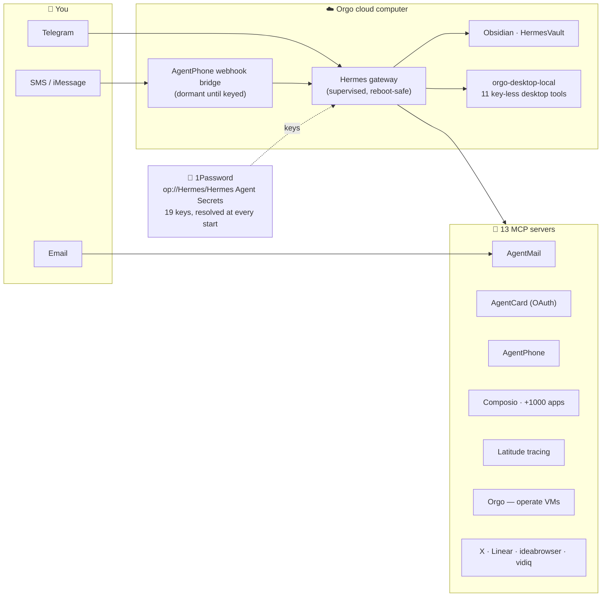

<div align="center">


# Revenue Partner Agent 🚀

**A source-grounded GTM operator that runs one Money Desk across reactivation, targeted outbound, affiliates, stages/sponsors, and coordinated content.**

[](https://orgo.ai)
[](https://github.com/NousResearch/hermes-agent)
[](#-whats-in-the-box)
[](https://github.com/jbellsolutions/super-browser)
[](#-your-keys-stay-yours)
[](LICENSE)

*Built on the supplied always-on Hermes/Orgo stack.*
*Grounded in the Revenue Partner landing page and all three supplied implementation videos.*

</div>

---

## Revenue Partner operating model

The template does not just rename the base agent. It adds a GTM execution contract derived from the supplied landing page and three implementation videos:

- **Two demand engines:** owned-demand recovery and new-demand acquisition.
- **Four coordinated channels:** affiliates/partners, direct outbound, reactivation, and social/content.
- **Four readiness pillars:** architecture, data, infrastructure, and execution.
- **Phased execution:** fit/map → architecture/story → infrastructure/data → launch → run/report/optimize.
- **Money Desk reporting:** booked, attended, qualified, opportunity, pipeline, and closed revenue stay separate.
- **SpeakerAgent Riley:** discovers/scores podcasts, stages, conferences, seminars, and sponsor opportunities; a human owns relationships and closing.
- **Human approval policy:** SOUL.md and the Revenue Partner skill require an approved campaign contract covering audience, source, sender, claims, volume, schedule, spend, suppression, CRM, pause, and stop bounds. Hard runtime gating is implemented in Super Browser and the AgentPhone bridge; other integrations remain governed by operator/tool permissions rather than a claimed universal campaign-record gate.
- **Source integrity:** the `2–4 booked meetings/day` statement is represented as a target, never a guarantee or typical result.
- **Persistent context:** a seeded `/root/agent-knowledge` vault holds fit, offer, ICP, approved claims, Money Desk mapping, campaigns, and reports.
- **Super Browser:** one provider-neutral MCP front door with eight adapters and build-time Playwright verification.

Canonical files:

- `files/SOUL.md`
- `files/skills/go-to-market/revenue-partner/SKILL.md`
- `files/skills/go-to-market/revenue-partner/references/source-ledger.md`
- `files/skills/go-to-market/revenue-partner/references/campaign-contract.md`
- `files/agent-knowledge/INDEX.md`

Build and test:

```bash
python3.11 -m unittest discover -s tests -v
uv run --no-project --with jsonschema --with certifi python build_template.py
```

Publish/build/launch with runtime credentials loaded outside the repository:

```bash
python build_template.py --remote-validate
python build_template.py --build
python build_template.py --launch <workspace-id>
```

---

## ✨ What it feels like

You launch a cloud desktop. A setup window signs you into the model, you scan a QR with your phone, tap **Create Bot** — and now there's an agent on Telegram that:

- 💬 **texts with you** all day (Telegram; SMS/iMessage via AgentPhone)
- 📬 **has its own email address** and reads/sends mail (AgentMail)
- 💳 **can spend, carefully** with its own virtual card (AgentCard)
- 🔌 **uses your apps** — Gmail, Slack, Calendar, Notion, +1000 (Composio)
- 🖥️ **drives its own desktop** and other Orgo computers (11 built-in desktop tools + the Orgo MCP)
- 📝 **keeps notes** in an Obsidian vault you can open right on its desktop
- 🔭 **supports full observability when configured** — Latitude can trace model and tool calls after credentials are connected
- 🔐 **fetches its own keys** from a 1Password vault you control

<div align="center">

<br/><em>First boot — the guided setup walks you through model sign-in, the Telegram QR, and 1Password.</em>
</div>

---

## 🗺️ How it's wired



Every integration ships **key-less**: an unset key just parks that server (it revives within 5 minutes of a key landing, or instantly via `/mcp` in chat). Nothing crash-loops, nothing nags.

---

## 🟢 Easiest way to run it

1. **Make an Orgo account** → [orgo.ai](https://orgo.ai).
2. **Launch the template** (see *Run your own copy* below, or the gallery entry if you're on the curated catalog).
3. The **Revenue Partner Setup** window walks you through:
   - **Connect Nous** — a quick device-code sign-in so `gpt-5.5` can think (it test-fires a 1-token call, so a zero-credit account fails loudly, not silently).
   - **Scan the QR** → tap **Create Bot** in Telegram → your personal bot is live. 🎉
   - **Optional: paste a 1Password service-account token** — one token, every key, forever.
4. **Text your bot.** You're done.

<details>
<summary><b>⚡ Power-ups — add any of these at any time</b> (tell the agent in chat, use the setup fields, or drop them in 1Password)</summary>

| Add | To get |
|---|---|
| **1Password service-account token** (`ops_…`) | the whole key map below, resolved automatically at every start |
| Composio consumer key (`ck_…`) | Gmail, Slack, Calendar, Notion, +1000 apps |
| AgentMail key (`am_…`) | the agent's own email inbox |
| AgentCard *(no key — the agent runs the OAuth itself)* | virtual cards the agent can spend on |
| AgentPhone key + agent id | SMS / iMessage via a push webhook bridge — no polling |
| Latitude key + project | a trace of every call the agent makes, queryable in chat |
| Orgo API key (+ this VM's id) | the agent operates Orgo computers, including itself |
| Linear (`hermes mcp login linear`) | issue tracking |
| Honcho key | long-term memory |

**1Password convention:** vault **`Hermes`** → Secure Note **`Hermes Agent Secrets`** → fields named exactly like the env vars (`AGENTMAIL_API_KEY`, `COMPOSIO_CONSUMER_KEY`, …). The service account only needs read access to that one vault.

</details>

---

## 📦 What's in the box

| | |
|---|---|
| **Agent** | Hermes Agent, installed during the deterministic image build; model setup remains operator-controlled |
| **Chat** | Optional Telegram onboarding when configured by the operator |
| **Secrets** | Runtime-only environment/secret-manager inputs; no credential values are embedded in the template |
| **Browser** | Pinned Super Browser bundle with eight adapters; each provider is usable only when its own readiness checks pass |
| **Phone** | Optional AgentPhone inbound bridge, deny-all until allowlisted and restricted to read-only research/vision toolsets |
| **Tracing** | Optional Latitude telemetry when configured and verified |
| **Desktop control** | Orgo-local desktop plugin, subject to live runtime verification |
| **Skills** | Curated Revenue Partner operating skill and its source, campaign, acceptance, and Money Desk references |
| **Persona** | Revenue Partner SOUL.md with fit gates, claim discipline, and approval boundaries |
| **Knowledge** | Operator-controlled company, ICP, claims, permissions, campaign, and reporting vault |

---

## 🔐 Your keys stay yours

The template declares no credential values. Keys belong only in the operator's runtime environment (`~/.hermes/.env` / `~/.hermes/.op.env`) or configured secret manager. Release verification includes an exact staged-tree credential scan; never commit generated launch files or dotenv files.

---

## 🛠️ Run your own copy

Publishing and building require an Orgo account with template-build access. Use the isolated dependency invocation so local validation cannot silently disappear:

```bash
export ORGO_API_KEY=sk_live_...                  # orgo.ai → API keys

uv run --no-project --with jsonschema --with certifi python build_template.py
uv run --no-project --with jsonschema --with certifi python build_template.py --build
uv run --no-project --with jsonschema --with certifi python build_template.py --launch <WORKSPACE_ID>
```

<details>
<summary><b>Make it yours — what's in <code>files/</code></b></summary>

- `config.yaml` — the Hermes config (model, 13 MCP servers, 16 plugins, the 1Password map)
- `SOUL.md` — the agent's personality
- `onboard.sh` / `telegram-pair.py` / `op-enable.py` — the first-boot setup
- `agentphone-bridge/` — the SMS/iMessage webhook bridge (supervised, dormant until keyed)
- `plugins/orgo-desktop-local/` + `scripts/` — the custom desktop-control plugin
- `local-packages/latitude-telemetry-hermes/` — the Latitude telemetry plugin (pip-installed at build)
- `skills/`, `vault/` — the skill library and the Obsidian vault

Edit those, bump the version, and rebuild:

```bash
VERSION=0.2.3 python3 build_template.py --build
```

`build_template.py` drives the full **publish → build → stream → launch** flow against the Orgo REST API (the `orgo` CLI has no template commands — REST is the path). The big file trees ship inside one deterministic base64 tarball — the publish endpoint caps the request body around 1 MB.

</details>

---

## ❓ FAQ

<details><summary><b>Do I need to code?</b></summary>
No — the launch + QR flow is point-and-click. Coding only matters if you want to <em>modify</em> the template.
</details>

<details><summary><b>Where do my keys go?</b></summary>
Only onto your own VM (or your own 1Password vault). This repo and the template contain none.
</details>

<details><summary><b>The model says it needs access?</b></summary>
<code>gpt-5.5</code> is a Nous model — make sure your Nous account has credits (the first-boot sign-in test-fires a call to check). Prefer ChatGPT? <code>hermes auth add openai-codex</code>, then set <code>model.default: gpt-5.6-sol</code> / <code>provider: openai-codex</code>.
</details>

<details><summary><b>Why is 1Password off until I paste a token?</b></summary>
Without a token, the <code>op</code> CLI prompts interactively on every start — so the map ships disabled and flips on automatically the moment your token lands.
</details>

<details><summary><b>Can I change the personality or model?</b></summary>
Yes — edit <code>SOUL.md</code> / <code>config.yaml</code> and rebuild (or just tell the agent).
</details>

---

<div align="center">

MIT licensed · Hermes Agent by [Nous Research](https://github.com/NousResearch/hermes-agent) · cloud computers by [Orgo](https://orgo.ai)

*Built from reusable agent infrastructure; Revenue Partner deployment and runtime evidence are verified separately for each published version.*

</div>
