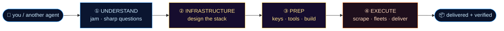
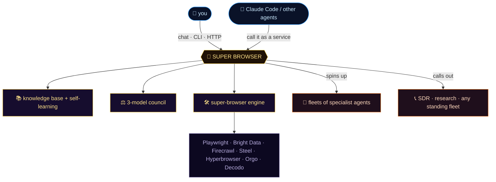

<p align="center">
  
</p>

<p align="center">
  <b>An AI agent you talk to that's an expert at anything browser-heavy —<br>
  and can command a fleet of agents to actually get it done.</b>
</p>

<p align="center">
  Runs entirely on <b>open-source models</b> &nbsp;·&nbsp; cheap to think with &nbsp;·&nbsp; honest about what works.
</p>

<p align="center">
  
  
  
  
  
</p>

---

## 🧠 What it is

Super Browser is a senior engineer who has shipped on every browser-automation stack, never bluffs, and can put a team of agents to work for you. Bring it a project — **research, scraping, monitoring, competitive intel, data-gathering, lead-gen, anything browser-heavy** — and it runs every one through four phases, never skipping ahead:



Along the way it convenes a **3-model council** (three *different* open-source models debate the hard calls and hand you a verdict **plus the dissent**), draws on a **knowledge base it learns into**, and works in **both directions** — you talk to it as the boss, and other agents call it as a service.

---

## 🦾 Real hands + a 35-tool arsenal

It doesn't just *plan* — it acts, on **open-source models**, with real computer use:

- **🌐 Real browser** (`browser_use`) — a self-hosted headless-Chromium agent that navigates, clicks, fills, and extracts on *any* site, including JS-heavy and logged-in pages.
- **⌨️ Code & terminal** (`code_agent`) — an autonomous coder (Aider) that writes and runs scripts for data/code work.
- **🧰 1000s of app tools** (Composio) — Gmail, GitHub, and more, merged straight into the toolset.
- **💬 Native Slack** (`slack_action`) — read channels, post, and react on your own bot token.
- **🧠 3-provider OSS brain** — Together → OpenRouter → Fireworks auto-failover, so a turn always completes.
- **☀️ Daily browser-agent digest** — every morning at 6 AM it Slacks you [5–10 specific browser-agent moves](docs/daily-browser-ops.md) for the day, grounded in what your business is actually doing.

…on top of the originals: **fleets** of parallel specialist agents, the **scraper engine** (Bright Data · Firecrawl · Steel · Hyperbrowser · Orgo), self-learning, and Obsidian-vault memory.

---

## ⚡ Setup — about two minutes, no build step

Add your keys (see [`.env.super-browser.example`](.env.super-browser.example)):

| Key | Needed? | What it's for |
|---|:---:|---|
| `OLLAMA_API_KEY` | ✅ **required** | primary OSS model key (Together / Ollama Cloud) — powers the brain |
| `OLLAMA_MODEL` | optional | which model (default `glm-5.2`) |
| `OPENROUTER_API_KEY` · `FIREWORKS_API_KEY` | optional | 2nd + 3rd provider tiers (automatic failover) |
| `COMPOSIO_API_KEY` + `COMPOSIO_APPS` | optional | app tools (Gmail / GitHub / …) |
| `SLACK_BOT_TOKEN` | optional | native Slack actions + the daily digest |
| `FIRECRAWL_API_KEY` | optional | scrape obscure long-tail sites |
| `SUPER_BROWSER_REPO_ROOT` | optional | path to the browser engine |

> Real computer use is optional and degrades gracefully: `browser_use` needs `pip install browser-use && playwright install chromium`; `code_agent` needs `aider-chat`. Without them, the agent simply skips those tools.

Then say hi:
```bash
.venv/bin/python scripts/talk_super_browser.py --prompt "Who are you, and which phase do we start in?"
```

---

## 💬 Three ways to talk to it

<table>
<tr>
<td width="33%" valign="top">

**① Jam with it**

```bash
python scripts/talk_super_browser.py
```
A real conversation. It asks, plans, and — once you're aligned — goes and does it.

</td>
<td width="33%" valign="top">

**② One-shot**

```bash
python scripts/talk_super_browser.py \
  --prompt "best provider for a Cloudflare site?"
```
Quick asks, or call it from a script.

</td>
<td width="33%" valign="top">

**③ As a service**

```bash
python scripts/super_browser_server.py
# POST → :8088/ask
```
So Claude Code or any agent can call it.

</td>
</tr>
</table>

---

## 🎯 What you can ask it

| Say this | It does |
|---|---|
| *"Research the best residential proxy providers in 2026."* | spins up a **fleet of research agents**, one per angle, in parallel |
| *"Get me every plumber in Tampa — name, phone, website."* | scrapes the directory → a clean spreadsheet |
| *"Now do Tampa, Orlando, and Miami."* | a parallel fleet, deduped into one list |
| *"Steel or Bright Data for this job?"* | convenes the **3-model council** → verdict + dissent |
| *"Hand those off to the SDR fleet."* | delegates to **any** downstream fleet of agents |

It's general — swap "plumbers" for *research papers*, *competitor pricing pages*, or *grant listings*, and it works the same way.

---

## 🔺 The power ladder

It always starts at the **lowest power level that can do the job**, and only powers up when the task demands it — so you never overpay for capability you don't need.

<p align="center">
  
</p>

---

## 🏗️ How it's wired



---

## 🗺️ The map

| File | What it is |
|---|---|
| `scripts/talk_super_browser.py` | **the agent** — chat, 35 tools, the brain |
| `scripts/daily_browser_ops.py` | **daily 6 AM digest** — browser-agent moves → Slack ([docs](docs/daily-browser-ops.md)) |
| `scripts/llm_client.py` | the 3-provider failover client (Together → OpenRouter → Fireworks) |
| `scripts/slack_super_browser.py` · `telegram_super_browser.py` | the Slack + Telegram channels |
| `scripts/super_browser_server.py` | the HTTP service (call it from other agents) |
| `scripts/fleet.py` | **general fleets** — spin up agents for *any* task |
| `scripts/lead_pipeline.py` | sourcing (directory → structured leads) — one example use case |
| `scripts/learn.py` | self-learning — it improves from its own runs |
| `src/agent_os/quality/invocations/council.py` | the 3-model council |
| `identities/super_browser.yaml` | its personality + how it thinks |
| `vault/super_browser/` | everything it remembers: conversations, knowledge, leads |
| [`ENGINE.md`](ENGINE.md) | the underlying engine — provider ladder, CLI, MCP server, approval gates |

---

<p align="center">
  <i>Runs on your open-source models. &nbsp;Logs everything to your Obsidian vault. &nbsp;A doer <b>and</b> a tool.</i>
  <br><br>
  🐉 &nbsp;<b>SUPER BROWSER</b>
</p>
